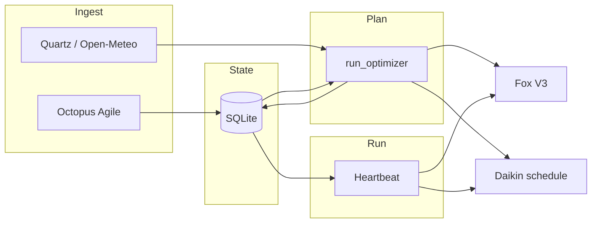

# Architecture — the planning brain

Home Energy Manager is designed as the **single planning brain** for the site: it **captures tariffs**, **fuses them with weather and observed energy behaviour**, **estimates needs**, and **emits concrete schedules** for Fox ESS and Daikin. OpenClaw, the REST API, and dashboards are **interfaces** to that brain; they do not replace it.

**Runtime shape (since the 2026-04-25 cutover):** an **immutable Docker container** (`hem`, uid 1001, read-only rootfs) pulled from GHCR and run by `hem.service` via `docker compose`. Host state lives in `/srv/hem/` — `data/` (SQLite at `/srv/hem/data/energy_state.db`, tokens) and `.env`; the code is never editable on the host. Python 3.12 inside the image. A short-lived native-systemd deployment (2026-04-18 → 2026-04-25) has been reversed. See [RUNBOOK.md](RUNBOOK.md) for the live ops contract and `deploy/README.md` for install/rollback.

## Data the brain uses

| Source | Role |
|--------|------|
| **Octopus Agile** (half-hourly unit rates) | Stored in SQLite (`agile_rates`); drives cheap / peak / negative classification and cost math. |
| **Quartz PV nowcast** (`src/weather.py`) | Preferred PV source for the site when configured; direct PV is calibrated to local shading/orientation before the LP consumes it. |
| **Open-Meteo forecast** (`src/weather.py`) | Per-slot temperature, irradiance, cloud cover → weather fallback/context and derived PV / heating demand inputs. |
| **Rolling load proxy** (`execution_log` → mean kWh per half-hour) | Estimates typical import power needs; **battery margin** logic can extend pre-peak charge windows when peak load might exceed usable battery. |
| **Fox realtime (cached)** | Battery **SoC**, work mode — guards and heartbeat context (not a polling loop; ~30s cache, sparse scheduler checks). |
| **Daikin live telemetry** | Room/outdoor temps, LWT offset, tank — **heartbeat** applies SQLite actions, **frost cap** on peak setback when outdoor is cold. |
| **Config** | PV kWp, battery kWh, GSP/tariff codes, thresholds, timezone. |

## Planning pipeline (bulletproof)

1. **Ingest** — `src/scheduler/octopus_fetch.py`: fetch Agile → `save_agile_rates`, update fetch state, optional survival mode after prolonged failure.
2. **Optimize** — `src/scheduler/optimizer.py` (`run_optimizer`): read rates from SQLite, `fetch_forecast`. **Default (`OPTIMIZER_BACKEND=lp`):** `src/scheduler/lp_optimizer.solve_lp` — PuLP MILP over `LP_HORIZON_HOURS` (battery + grid + PV + DHW tank + building/radiators, COP vs outdoor temp, comfort slack). **Fallback (`OPTIMIZER_BACKEND=heuristic`):** price-quantile `_classify_slots`, overnight charge consolidation, pre-peak extension. Then compute VWAP / strategy text, `save_daily_target`.
3. **Actuate (plan)** — Same run: merge Fox windows → **Scheduler V3** upload + snapshot in DB; write **Daikin** `action_schedule` rows (pre-heat, peak shutdown, restore, etc.).
4. **Execute (runtime)** — `src/scheduler/runner.py` heartbeat: **reconcile** today’s Daikin rows, log **execution_log** on each local half-hour boundary, **repair** Fox scheduler flag / V3 vs SQLite ~30 min, low-SoC / price alerts.

## Retired V7 stack

The older consent-driven **solver + dispatcher** (`src/optimization/`) was removed so only the Bulletproof path can schedule hardware. To restore that code for archaeology or experiments, use git tag **`pre-v7-removal`**:  
`git checkout pre-v7-removal -- src/optimization`

## API touchpoints

- **Tariff / weather context**: `GET /api/v1/weather`, schedule + metrics endpoints, energy report.
- **MCP** (optional): `get_energy_metrics`, `get_schedule`, `get_battery_forecast`, `get_weather_context`, etc., all read the same DB and services.

## Design constraints

- **Fox Open API ~1440 calls/day soft budget (hard ~1440)** — realtime cache TTL 300 s; one V3 upload per optimizer run **and now skipped when the groups-list fingerprint is unchanged** (#38 / PR #61); all Fox HTTP calls tracked in `api_call_log` (see ADR-001).
- **Daikin Onecta ~200 calls/day** — device cache TTL 1800 s; the **heartbeat never refreshes** (it passes `allow_refresh=False` unconditionally, Phase A / #306), so the cache is warmed only by plan dispatch, the twice-daily briefs, and manual/MCP calls. (`DAIKIN_CALIBRATION_WINDOWS_LOCAL` and the Octopus pre-slot refresh window are **dead**: the gate functions survive in `runner.py` but nothing calls them.) Quota tracked persistently in SQLite (see ADR-001). **When exhausted**, `daikin_service.get_lp_state_cached_or_estimated` walks a physics estimator (`src/daikin/estimator.py`) forward from the last `source='live'` row in `daikin_telemetry` so the LP keeps planning (#55 / PR #62).
- **Daikin temperature calibration** — the LP compares forecast vs actual outdoor temperature through `forecast_skill_log`, which is rebuilt from canonical forecast rows plus Daikin telemetry. The solve uses an hour-of-day offset map so early mornings and afternoons can react to local conditions without extra API calls.
- **Runtime-tunable knobs** (comfort / strategy / MPC thresholds) — live via `PUT /api/v1/settings/{key}` → `runtime_settings` SQLite table → `config.*` property (30 s TTL + version counter). Schedule-class keys (`LP_PLAN_PUSH_HOUR/MINUTE`) hot-reload APScheduler cron jobs without a restart (#52 / PR #63). See `src/runtime_settings.py`.
- **`OPENCLAW_READ_ONLY`** — remote execute path respects read-only for safety.
- **Grid export (force discharge)** — the presets are **`normal | guests | vacation`** (`OPTIMIZATION_PRESET`; the old `travel` / `away` names are gone). In `normal` and `guests` the LP constrains `exp <= pv_use`, so the battery is **never** allowed to dump to the grid and `peak_export` cannot even be planned. Battery→grid arbitrage is a **`vacation`**-only behaviour, and each `peak_export` slot must additionally survive the scenario-LP filter (pessimistic export floor + economic margin) in `filter_robust_peak_export` before it reaches Scheduler V3 — see [DISPATCH_DECISIONS.md](DISPATCH_DECISIONS.md). **`ENERGY_STRATEGY_MODE`** (`savings_first` / `strict_savings`) and **`EXPORT_DISCHARGE_MIN_SOC_PERCENT`** were both **removed**; setting them does nothing. (`EXPORT_DISCHARGE_FLOOR_SOC_PERCENT` is unrelated and still live — it is the `fdSoc` target sent to Fox.)
- **Daikin (vacation)** — SQLite actions skip **cheap** and **negative** preheat windows; only **peak** setback (+ short **restore**) is written so the heat pump does not add load while Fox may export. At **normal** / **guests**, Daikin still follows the full cheap/peak/negative schedule. The API does **not** switch Onecta **operationMode** (heating/auto); adaptation is via **LWT offset, DHW tank, climate/tank power** on the heartbeat.

## V8/V9 Optimizer (PuLP MILP)

Production path when `OPTIMIZER_BACKEND=lp` (default). Implementation: `src/scheduler/lp_optimizer.py` (pure model), `src/scheduler/lp_dispatch.py` (Fox + Daikin writers), `src/weather.forecast_to_lp_inputs` (half-hour PV + COP series).

- **Objective:** Minimize \(\sum_i (\text{import}_i \cdot \text{price}_i - \text{export}_i \cdot \text{EXPORT_RATE_PENCE})\) plus tiny battery-cycle penalty and comfort-band slack penalty.
- **Constraints:** Half-hour energy balance; battery SoC with round-trip efficiency; mutex grid import vs export and charge vs discharge binaries; SEG-style **export ≤ PV use + discharge**; discrete heat-pump power buckets; DHW tank dynamics (UA loss to room); single-zone building / radiators (UA to outdoor, solar gain fraction, radiator thermal cap); shower windows and Legionella; terminal SoC/tank/indoor stitches.
- **Inputs:** Octopus rates for the horizon, Quartz/Open-Meteo → `WeatherLpSeries`, initial SoC (Fox cache), tank + room temps (Daikin / execution log fallbacks).
- **Rollback:** Set `OPTIMIZER_BACKEND=heuristic` or POST `/api/v1/optimization/backend` with `{"backend":"heuristic"}` to use the legacy classifier in the same `run_optimizer()` entrypoint.

### Slot classification (`lp_dispatch.py`)

After solving, each half-hour slot is classified by `lp_plan_to_slots()`:

| Kind | Condition | Fox action |
|---|---|---|
| `negative` | charge > 0 **and** grid_import > 0 **and** price ≤ 0 | `ForceCharge` fdSoc=100% |
| `cheap` | charge > 0 **and** grid_import > 0 | `ForceCharge` fdSoc=95% with LP-derived `fdPwr` |
| `solar_charge` | charge > 0 **and** grid_import ≈ 0 | `SelfUse` at `MIN_SOC_RESERVE_PERCENT` — PV fills the battery, inverter never auto-imports |
| `negative_hold` | price ≤ 0 **and** no LP-planned grid charge | `Backup` — strict no-discharge hold; house is grid-fed at the paid rate |
| `peak` | no HP, price ≥ peak threshold | `SelfUse` at reserve (or pinned `Backup` when the LP wants a hold) |
| `peak_export` | discharge + export beyond PV — **`vacation` preset only**, and only if the scenario filter commits it | `ForceDischarge` |
| `standard` | all other | `SelfUse` at reserve |

> ⚠️ **`SelfUse minSocOnGrid=100` is retired and never emitted.** It used to be
> the `solar_charge` shape, on the belief that a SelfUse group floor "only blocks
> battery discharge". **It does not: the H1 firmware ignores the SelfUse group's
> `minSocOnGrid` and discharges straight through it** — 40.6 % of samples across a
> 40,369-sample prod audit were below-floor discharge. Only the *global* reserve
> is a real floor, and the only proven no-discharge hold primitive on this
> hardware is **`Backup`** (used for `negative_hold` and for LP positive-price
> holds). `solar_charge` therefore maps to plain `SelfUse` at reserve
> (`LP_SOLAR_CHARGE_FOX_MODE=selfuse`, the default) — see `_slot_fox_tuple` in
> `src/scheduler/optimizer.py`. The distinction from V8 still holds: "charge from
> PV, no grid import" maps to `SelfUse`, not `ForceCharge`.

### MPC loop (Model Predictive Control)

Re-planning is **event-driven** (V12 — the fixed-hour `LP_MPC_HOURS` cron was removed):

| Trigger | When | Purpose |
|---|---|---|
| `octopus_fetch` | ~16:05 local | **Critical**: tomorrow's rates published → LP replans the full horizon |
| `tier_boundary` | `TIER_BOUNDARY_LEAD_MINUTES` before each tariff tier transition | Re-plan exactly when the price regime changes |
| `plan_push` | 00:05 UTC (`LP_PLAN_PUSH_HOUR:MINUTE`) | Nightly full-day dispatch — lands on a fresh Daikin quota day |
| `soc_drift` / `import_overshoot` / `pv_upside` / `pv_downside` / `load_upside` | 5-min heartbeat, threshold + hysteresis gated | Live state diverged from the committed plan |
| `forecast_revision` | Open-Meteo refresh interval | Next-6h PV/temperature forecast moved beyond thresholds |
| `dynamic_replan` | one-shot, when a plan was truncated to the Fox 8-group cap | Re-plan the truncated tail |

Every event trigger funnels through `bulletproof_mpc_job` (cooldown-gated, `MPC_COOLDOWN_SECONDS`) and pushes the updated Fox schedule to hardware; unchanged schedules are skipped at the `FoxESSClient.set_scheduler_v3` layer (PR #61). API budget impact: Fox ~100–400/day (well under 1440), Daikin ~50–100/day (well under 200) — Daikin PATCH calls only happen at slot transitions in the heartbeat, not on every MPC compute.
