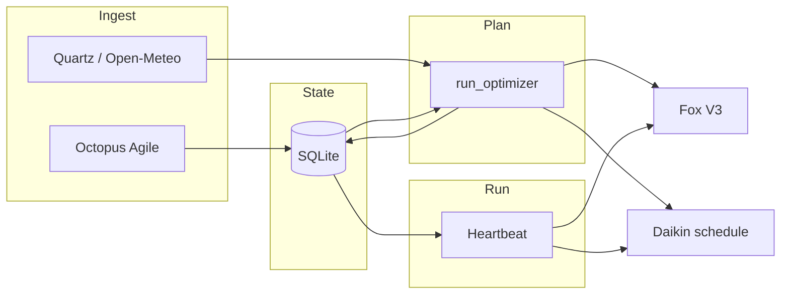

# Architecture — the planning brain

Home Energy Manager is designed as the **single planning brain** for the site: it **captures tariffs**, **fuses them with weather and observed energy behaviour**, **estimates needs**, and **emits concrete schedules** for Fox ESS and Daikin. OpenClaw, the REST API, and dashboards are **interfaces** to that brain; they do not replace it.

**Runtime shape (as of 2026-04-22):** native Python 3.12 service under systemd (`home-energy-manager.service`, `/root/home-energy-manager/.venv`), SQLite at `data/energy_state.db`. Docker was removed on 2026-04-18 — see [RUNBOOK.md](RUNBOOK.md) for the live ops contract.

## Data the brain uses

| Source | Role |
|--------|------|
| **Octopus Agile** (half-hourly unit rates) | Stored in SQLite (`agile_rates`); drives cheap / peak / negative classification and cost math. |
| **Quartz PV nowcast** (`src/weather.py`) | Preferred PV source for the site when configured; direct PV is calibrated to local shading/orientation before the LP consumes it. |
| **Open-Meteo forecast** (`src/weather.py`) | Per-slot temperature, irradiance, cloud cover → weather fallback/context and derived PV / heating demand inputs. |
| **Rolling load proxy** (`execution_log` → mean kWh per half-hour) | Estimates typical import power needs; **battery margin** logic can extend pre-peak charge windows when peak load might exceed usable battery. |
| **Fox realtime (cached)** | Battery **SoC**, work mode — guards and heartbeat context (not a polling loop; ~30s cache, sparse scheduler checks). |
| **Daikin live telemetry** | Room/outdoor temps, LWT offset, tank — **heartbeat** applies SQLite actions, **frost cap** on peak setback when outdoor is cold. |
| **Config** | PV kWp, battery kWh, GSP/tariff codes, thresholds, timezone. |

## Planning pipeline (bulletproof)

1. **Ingest** — `src/scheduler/octopus_fetch.py`: fetch Agile → `save_agile_rates`, update fetch state, optional survival mode after prolonged failure.
2. **Optimize** — `src/scheduler/optimizer.py` (`run_optimizer`): read rates from SQLite, `fetch_forecast`. **Default (`OPTIMIZER_BACKEND=lp`):** `src/scheduler/lp_optimizer.solve_lp` — PuLP MILP over `LP_HORIZON_HOURS` (battery + grid + PV + DHW tank + building/radiators, COP vs outdoor temp, comfort slack). **Fallback (`OPTIMIZER_BACKEND=heuristic`):** price-quantile `_classify_slots`, overnight charge consolidation, pre-peak extension. Then compute VWAP / strategy text, `save_daily_target`.
3. **Actuate (plan)** — Same run: merge Fox windows → **Scheduler V3** upload + snapshot in DB; write **Daikin** `action_schedule` rows (pre-heat, peak shutdown, restore, etc.).
4. **Execute (runtime)** — `src/scheduler/runner.py` heartbeat: **reconcile** today’s Daikin rows, log **execution_log** on each local half-hour boundary, **repair** Fox scheduler flag / V3 vs SQLite ~30 min, low-SoC / price alerts.

## Retired V7 stack

The older consent-driven **solver + dispatcher** (`src/optimization/`) was removed so only the Bulletproof path can schedule hardware. To restore that code for archaeology or experiments, use git tag **`pre-v7-removal`**:  
`git checkout pre-v7-removal -- src/optimization`

## API touchpoints

- **Tariff / weather context**: `GET /api/v1/weather`, schedule + metrics endpoints, energy report.
- **MCP** (optional): `get_energy_metrics`, `get_schedule`, `get_battery_forecast`, `get_weather_context`, etc., all read the same DB and services.

## Design constraints

- **Fox Open API ~1440 calls/day soft budget (hard ~1440)** — realtime cache TTL 300 s; one V3 upload per optimizer run **and now skipped when the groups-list fingerprint is unchanged** (#38 / PR #61); all Fox HTTP calls tracked in `api_call_log` (see ADR-001).
- **Daikin Onecta ~200 calls/day** — device cache TTL 1800 s; live refresh only in the 5-min Octopus pre-slot window (HH:25–30, HH:55–00); quota tracked persistently in SQLite (see ADR-001). **When exhausted**, `daikin_service.get_lp_state_cached_or_estimated` walks a physics estimator (`src/daikin/estimator.py`) forward from the last `source='live'` row in `daikin_telemetry` so the LP keeps planning (#55 / PR #62).
- **Runtime-tunable knobs** (comfort / strategy / MPC cadence) — live via `PUT /api/v1/settings/{key}` → `runtime_settings` SQLite table → `config.*` property (30 s TTL + version counter). Schedule-class keys (`LP_MPC_HOURS`, `LP_PLAN_PUSH_HOUR/MINUTE`) hot-reload APScheduler cron jobs without a restart (#52 / PR #63). See `src/runtime_settings.py`.
- **`OPENCLAW_READ_ONLY`** — remote execute path respects read-only for safety.
- **Grid export (force discharge)** — default **`ENERGY_STRATEGY_MODE=savings_first`**: prioritise self-use and import savings; Scheduler V3 may use **ForceDischarge** on **peak** slots only when **`OPTIMIZATION_PRESET`** is **travel** or **away** *and* cached battery SoC ≥ **`EXPORT_DISCHARGE_MIN_SOC_PERCENT`** (default 95). Set **`strict_savings`** to disable peak export discharge entirely.
- **Daikin (travel/away)** — SQLite actions skip **cheap** and **negative** preheat windows; only **peak** setback (+ short **restore**) is written so the heat pump does not add load while Fox may export. At **normal** preset, Daikin still follows full cheap/peak/negative schedule. The API does **not** switch Onecta **operationMode** (heating/auto); adaptation is via **LWT offset, DHW tank, climate/tank power** on the heartbeat.

## V8/V9 Optimizer (PuLP MILP)

Production path when `OPTIMIZER_BACKEND=lp` (default). Implementation: `src/scheduler/lp_optimizer.py` (pure model), `src/scheduler/lp_dispatch.py` (Fox + Daikin writers), `src/weather.forecast_to_lp_inputs` (half-hour PV + COP series).

- **Objective:** Minimize \(\sum_i (\text{import}_i \cdot \text{price}_i - \text{export}_i \cdot \text{EXPORT_RATE_PENCE})\) plus tiny battery-cycle penalty and comfort-band slack penalty.
- **Constraints:** Half-hour energy balance; battery SoC with round-trip efficiency; mutex grid import vs export and charge vs discharge binaries; SEG-style **export ≤ PV use + discharge**; discrete heat-pump power buckets; DHW tank dynamics (UA loss to room); single-zone building / radiators (UA to outdoor, solar gain fraction, radiator thermal cap); shower windows and Legionella; terminal SoC/tank/indoor stitches.
- **Inputs:** Octopus rates for the horizon, Quartz/Open-Meteo → `WeatherLpSeries`, initial SoC (Fox cache), tank + room temps (Daikin / execution log fallbacks).
- **Rollback:** Set `OPTIMIZER_BACKEND=heuristic` or POST `/api/v1/optimization/backend` with `{"backend":"heuristic"}` to use the legacy classifier in the same `run_optimizer()` entrypoint.

### Slot classification (`lp_dispatch.py`)

After solving, each half-hour slot is classified by `lp_plan_to_slots()`:

| Kind | Condition | Fox action |
|---|---|---|
| `negative` | charge > 0 **and** grid_import > 0 **and** price ≤ 0 | `ForceCharge` fdSoc=100% |
| `cheap` | charge > 0 **and** grid_import > 0 | `ForceCharge` fdSoc=95% with LP-derived `fdPwr` |
| `solar_charge` | charge > 0 **and** grid_import ≈ 0 | `SelfUse` **minSocOnGrid=100%** — holds battery, PV fills it |
| `peak` | no HP, price ≥ peak threshold | `SelfUse` minSocOnGrid=10% |
| `peak_export` | discharge + export, travel/away preset | `ForceDischarge` |
| `standard` | all other | `SelfUse` minSocOnGrid=10% |

`solar_charge` is the key distinction from V8: the LP saying "charge from PV, no grid import" now maps to `SelfUse` instead of `ForceCharge`. FoxESS `SelfUse` mode never actively imports from grid — `minSocOnGrid=100%` only blocks battery discharge, allowing excess PV to accumulate freely.

### MPC loop (Model Predictive Control)

The plan is re-computed at four intra-day checkpoints and after the Octopus rate publish:

| Time (BST) | Trigger | Purpose |
|---|---|---|
| 06:00 | `LP_MPC_HOURS` cron | Morning anchor: live SoC after overnight ForceCharge |
| 12:00 | `LP_MPC_HOURS` cron | Mid-day: add ForceCharge if solar underdelivered |
| 21:00 | `LP_MPC_HOURS` cron | Late-evening: re-seed from full-day actuals |
| ~16:05 | `bulletproof_octopus_fetch_job` | **Critical**: tomorrow's rates published → LP replans full 36h horizon |
| 00:05 UTC | `LP_PLAN_PUSH_HOUR:MINUTE` (UTC-anchored) | Nightly full-day dispatch — lands on a fresh Daikin quota day |

`LP_MPC_HOURS` is runtime-tunable (PUT `/api/v1/settings/LP_MPC_HOURS`) and the cron jobs re-register live (PR #63). `LP_MPC_WRITE_DEVICES=true` makes each checkpoint push the updated Fox schedule to hardware; unchanged schedules are skipped at the `FoxESSClient.set_scheduler_v3` layer (PR #61). API budget impact: Fox ~100–400/day (well under 1440), Daikin ~50–100/day (well under 200) — Daikin PATCH calls only happen at slot transitions in the heartbeat, not on every MPC compute.
