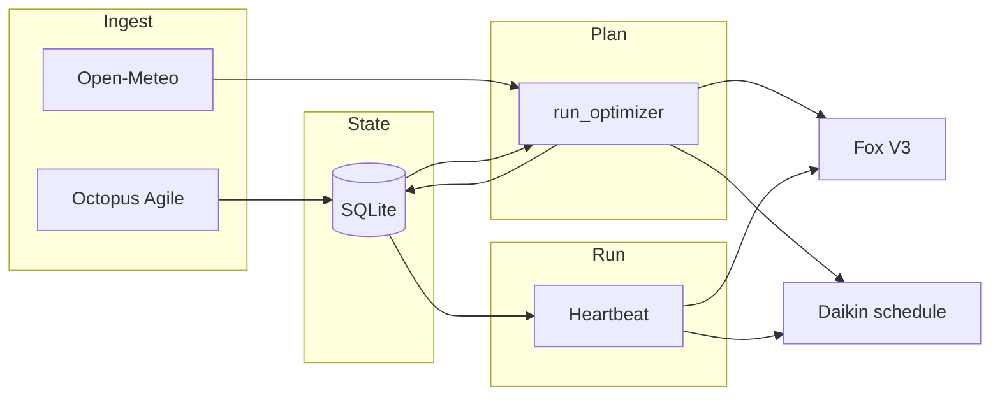

# Architecture — the planning brain

Home Energy Manager is designed as the **single planning brain** for the site: it **captures tariffs**, **fuses them with weather and observed energy behaviour**, **estimates needs**, and **emits concrete schedules** for Fox ESS and Daikin. OpenClaw, the REST API, and dashboards are **interfaces** to that brain; they do not replace it.

## Data the brain uses

| Source | Role |
|--------|------|
| **Octopus Agile** (half-hourly unit rates) | Stored in SQLite (`agile_rates`); drives cheap / peak / negative classification and cost math. |
| **Open-Meteo forecast** (`src/weather.py`) | Per-slot temperature, irradiance → **estimated PV (kW)** and **heating demand factor**; steers “skip forced cheap when solar will cover” and Daikin pre-heat / peak frost logic. |
| **Rolling load proxy** (`execution_log` → mean kWh per half-hour) | Estimates typical import power needs; **battery margin** logic can extend pre-peak charge windows when peak load might exceed usable battery. |
| **Fox realtime (cached)** | Battery **SoC**, work mode — guards and heartbeat context (not a polling loop; ~30s cache, sparse scheduler checks). |
| **Daikin live telemetry** | Room/outdoor temps, LWT offset, tank — **heartbeat** applies SQLite actions, **frost cap** on peak setback when outdoor is cold. |
| **Config** | PV kWp, battery kWh, GSP/tariff codes, thresholds, timezone. |

## Planning pipeline (bulletproof)

1. **Ingest** — `src/scheduler/octopus_fetch.py`: fetch Agile → `save_agile_rates`, update fetch state, optional survival mode after prolonged failure.
2. **Optimize** — `src/scheduler/optimizer.py` (`run_optimizer`): read rates from DB for **tomorrow**, `fetch_forecast`, build half-hour slots, `_classify_slots` (price quantiles **+ forecast**: e.g. strong solar can downgrade “cheap” to “standard”), optional **pre-peak extension** if battery vs estimated peak demand is tight, compute VWAP / strategy text, `save_daily_target`.
3. **Actuate (plan)** — Same run: merge Fox windows → **Scheduler V3** upload + snapshot in DB; write **Daikin** `action_schedule` rows (pre-heat, peak shutdown, restore, etc.).
4. **Execute (runtime)** — `src/scheduler/runner.py` heartbeat: **reconcile** today’s Daikin rows, log **execution_log** on each local half-hour boundary, **repair** Fox scheduler flag / V3 vs SQLite ~30 min, low-SoC / price alerts.

## Retired V7 stack

The older consent-driven **solver + dispatcher** (`src/optimization/`) was removed so only the Bulletproof path can schedule hardware. To restore that code for archaeology or experiments, use git tag **`pre-v7-removal`**:  
`git checkout pre-v7-removal -- src/optimization`

## API touchpoints

- **Tariff / weather context**: `GET /api/v1/weather`, schedule + metrics endpoints, energy report.
- **MCP** (optional): `get_energy_metrics`, `get_schedule`, `get_battery_forecast`, `get_weather_context`, etc., all read the same DB and services.

## Design constraints

- **Fox Open API ~200 calls/day** — no tight polling; one V3 upload per optimizer run, cached realtime, ~30 min scheduler verification.
- **`OPENCLAW_READ_ONLY`** — remote execute path respects read-only for safety.
- **Grid export (force discharge)** — default **`ENERGY_STRATEGY_MODE=savings_first`**: prioritise self-use and import savings; Scheduler V3 may use **ForceDischarge** on **peak** slots only when **`OPTIMIZATION_PRESET`** is **travel** or **away** *and* cached battery SoC ≥ **`EXPORT_DISCHARGE_MIN_SOC_PERCENT`** (default 95). Set **`strict_savings`** to disable peak export discharge entirely.
- **Daikin (travel/away)** — SQLite actions skip **cheap** and **negative** preheat windows; only **peak** setback (+ short **restore**) is written so the heat pump does not add load while Fox may export. At **normal** preset, Daikin still follows full cheap/peak/negative schedule. The API does **not** switch Onecta **operationMode** (heating/auto); adaptation is via **LWT offset, DHW tank, climate/tank power** on the heartbeat.

## V8 Optimizer (PuLP Linear Programming)
As of April 2026, the heuristic "If/Else" rule-based optimizer is being replaced by a Mathematical Solver using `PuLP`.
- **Objective:** Minimize total cost (Import * Price - Export * 15p).
- **Thermal Battery:** The Daikin DHW tank is modeled as a thermal battery with 0.33°C/h thermal decay and a strict rule to hit 48°C at 07:00 and 20:00.
- **Electrical Battery:** FoxESS is modeled with its real SoC, Max Inverter limits (3kW), and Open-Meteo PV forecasting to handle precise grid import/export arbitrage.
The solver completely replaces manual peak avoidance by mathematically proving the cheapest route for 24h/48h horizons.
